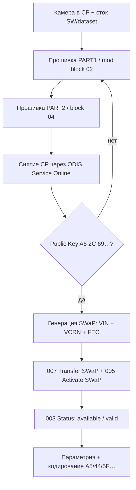

# 2Q0980653 摄像头 SWaP (MFK 3.0)

在前部辅助摄像头 **2Q0980653×**（经典 **MQB**，MFK 3.0）上解锁 **SWaP** 的完整说明。  
完成该流程后即可生成并输入你自己的 SWaP 码（Sign Assist、aLDW 等）—— 逻辑与 [ACC / pACC radar](pACC.md) 相同。

!!! warning ""
    所有操作 **风险自负**。错误的固件或参数集可能让摄像头「变砖」或产生 **Dataset Implausible** 错误。  
    本说明 **不适用于** **5WA 980 653** 摄像头（MQB-Evo）—— 见 [Travel Assist MQB-Evo](../MQB-Evo/travelAssist.md)。

!!! note "来源"
    现成固件文件 —— [mibsolution.one](https://mibsolution.one/) 上的 **A5_2Q0_SWaP_Solution** 压缩包（`MQB_Solution` → `pACC` → `A5_2Q0_SWaP_Solution`，登录 `guest` / `guest`）。

## 摄像头上的 SWaP 是什么

**SWaP** —— 一段签名码 (RSA)，与 **VIN**、单元的 **VCRN** 及 **FEC** 列表绑定。出厂码由 VW 的密钥签名。  
要**自行**生成码，需通过专用固件替换摄像头 EEPROM 中的**公钥**。换钥后使用与 **2Q0 radar** 相同的生成器（`A6 2C 69 …`）。

SWaP 之后的 Lane Assist、FLA 等编码 —— 见 [2Q0* 摄像头编码](2Q0_assistants.md)。

## 2Q0 摄像头的 FEC 码

| FEC                   | 用途                                |
|-----------------------|-------------------------------------|
| `100E0F00`            | Sign Assist (VZE / TSR)             |
| `100E1000`            | 增强车道引导 (aLDW)                 |
| `100E1100`–`100E1500` | 保留（导航）                        |
| `100E1600`            | 路径上的物体识别                    |
| `100E1700`            | 行人识别 (FCPW)                     |

生成器的最大码集（用空格分隔）：

```
100E0F00 100E1000 100E1100 100E1200 100E1300 100E1400 100E1500 100E1600 100E1700
```

## 需要准备什么

|               |                                                                                               |
|---------------|-----------------------------------------------------------------------------------------------|
| **单元**      | **A5** / **00A5**，摄像头 **2Q0980653**（字母 D/J/…  —— 核对 SW）                             |
| **软件**      | ODIS **Service**（在线，解除 CP）、ODIS **Engineering** 17–18                                 |
| **适配器**    | VAS6154A / VNCI（刷机首选「灰色」6154）                                                       |
| **状态**      | 摄像头处于 **Component Protection (CP)**，**原厂**固件和**原厂** dataset                      |
| **生成器**    | [accGenerator.zip](../firmwares/accGenerator.zip) —— `afcg.exe`、`FecCalc.py`（同 radar） |

!!! tip ""
    刷机前若刷过自定义参数集，请**恢复原厂参数集**。否则 SWaP 后常残留 **Dataset Implausible** 且 VZE 不工作。

## 总体流程



---

## 替换 SWaP 公钥

有两种方法设置自己的公钥（`A6 2C 69 …`）。后续步骤（生成 SWaP、激活、编码）两者相同。

=== "方法 A —— PART1 / PART2（推荐）"

    mibsolution.one 上的 **A5_2Q0_SWaP_Solution** 压缩包为每个 SW 版本提供两个文件：

    | 文件                     | 内容                                            |
    |--------------------------|-------------------------------------------------------|
    | `2Q0980653*_PART1.odx-f` | 修改过的 **块 02**（你自己的公钥）                    |
    | `2Q0980653*_PART2.odx-f` | **块 04** —— 让摄像头退出编程模式                     |

    同一资源上还有**所有版本的现成修改固件**（见 [Drive2 帖子](https://www.drive2.ru/b/696873494415150543/)的 UPD）。

    #### 第 1 步. 准备

    1. 安装摄像头，连接 CAN（Extended + 如需连接 radar 的 Local）。
    2. 备份 **A5** 的编码/适配（ODIS E → **046** 或手动导出）。
    3. 确认：固件和 dataset 为**出厂状态**。
    4. 将 **00A5** 单元置于 **Component Protection** —— 首次安装「外来」摄像头时，会在 SWaP **之前**于 ODIS Service 进行**硬件适配**时发生。

    #### 第 2 步. 刷写 (ODIS Engineering)

    单元 **A5** → **042 — 刷写**：

    1. 按你的字母/SW 刷写 **`…PART1.odx-f`**。  
       过程**会以错误结束** —— 块 02 在等待签名。摄像头会「卡」在 programming mode。**这是正常的。**
    2. 立即刷写 **`…PART2.odx-f`**。  
       摄像头应恢复工作状态。

    !!! danger ""
        **PART1 → PART2** 的顺序是强制的。步骤之间不要断电。刷写可能耗时 **40+ 分钟**（6154）。

    #### 第 3 步. 解除 Component Protection

    ODIS **Service**，**在线访问**（GeKo / UMA）：

    1. 解除 **A5** 单元的 CP。
    2. 如果 Service 看不到 CP —— 选择一个出厂就装有此类摄像头的车型（例如 VW Polo GTI AW1），如[详细帖子](https://www.drive2.ru/l/700119252740344031/)所述。

    #### 第 4 步. 检查公钥

    **A5** → **003 — 测量值** → **SWaP Public Key…**

    应以 **`A6 2C 69 …`** 开头（与 [pACC](pACC.md) 中的 2Q0 radar 相同）。

    如果公钥**已经**是 `A6 2C 69 …` —— 可跳过刷写，直接进入 [生成 SWaP](#генерация-swap-кода)。

=== "方法 B —— 手动替换公钥"

    如果没有来自 mibsolution.one 的 PART1/PART2 —— 参照 [Drive2 短帖](https://www.drive2.ru/b/696873494415150543/) 的逻辑。

    #### 1. 准备固件

    1. 取摄像头的 **.odx-f** 固件（像参数集那样解压 ZIP）。
    2. 在**程序块 02** 中将 **RSA 公钥**替换为你自己的 —— 通常取 **2Q0 radar** 的密钥（来自 [accGenerator.zip](../firmwares/accGenerator.zip) 的 `A6 2C 69 …`）。
    3. 把文件重新打包。

    #### 2. 在 CP 激活时刷写

    1. 摄像头**必须**处于 CP。
    2. ODIS E → **042** → 刷写修改后的文件。
    3. **块 02** 在无有效签名情况下刷入 → 报错、进入 programming mode —— **属预期**。
    4. **再刷另一个块**（例如 **04**）—— 来自同一固件，流程会结束。

    块的顺序可以调整；关键是**改过的 02 必须进入摄像头**。

    #### 3. 解除 CP 并检查密钥

    如**方法 A —— 第 3 步**和**第 4 步**（在 ODIS Service 解除 CP，然后在测量值中检查 **SWaP Public Key**）。

---

## 生成 SWaP 码

需要三个值：

| 参数     | 从哪里获取                                   |
|----------|----------------------------------------------|
| **VIN**  | 车辆                                         |
| **VCRN** | A5 → **003** → *个性化识别码*                |
| **FEC**  | 上面的表格                                   |

**生成器**（来自 [accGenerator.zip](../firmwares/accGenerator.zip)）：

=== "FecCalc.py"

    ```bash
    python FecCalc.py
    ```
    在询问 FEC 码集时可直接按 **Enter** —— 会套用摄像头的所有码。

=== "afcg.exe"

    1. VIN  
    2. VCRN  
    3. 用空格分隔的 FEC  
    4. 项目 **`4`** —— 行 **`2Q0_MRR MQB`**


## 输入与激活 SWaP (ODIS Engineering)

单元 **A5**：

``` yaml title="Login code: 20103（若请求块 008）"
009 — 诊断会话 → 下线模式 (EOL)
008 — 访问权限 → 20103
007 — 适配 → 传输 SWaP 功能解锁码 → 粘贴生成的码
005 — 基本设置 → 激活 SWaP 功能 / Unlock SWaP Feature
003 — 测量值 → 所有 SWaP 功能的状态
```


成功：每个 FEC 都显示 **available**、**valid**、**condition met**（可用 / 有效 / 条件满足）。

radar **13** 的相同流程 —— 见 [pACC，第 8 步](pACC.md#прошивка-и-генерация-swap-кода)。

---

## SWaP 之后

1. 摄像头**标定**（若安装后需要）—— 类比参见 [3Q* 标定](3Q0_calibration.md)及 ODIS 文档。
2. 刷入**合适的参数集** —— [摄像头固件](camAssistFirmwares.md)。
3. **编码** A5、44、5F、17、09、19 —— [2Q0* 摄像头编码](2Q0_assistants.md)。

!!! tip ""
    TJA 和部分功能需要**参数集**，而不仅是 SWaP。Sign Assist (VZE) —— 首先是 **SWaP + 编码**。

---

## 限制

| 主题                    | 备注                                                                                                             |
|-------------------------|-------------------------------------------------------------------------------------------------------------------------|
| **G / H 固件**          | 公钥为 **RSA3072**（更长），块刷写逻辑不同 —— 没有单独方案时该方法可能**不工作** |
| **MQB-Evo 5WA 980 653** | 不同的摄像头和 SW —— 本页**不适用**                                                                      |
| **SFD / SFD2**          | 经典 MQB 上的 **2Q0** 通常不需要；新车请单独确认                                   |
| **Dataset**             | 只用经过验证的参数集；编辑器里来路不明的 XML 常常会破坏 VZE                                               |
